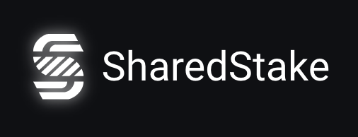

# SharedStake

Ethereum 2.0 va a ser uno de los mayores eventos en la historia de las criptomonedas. Asegurar esta nueva red es un paso crucial para impulsar la adopción global masiva, y el retorno anual \(APY\) que ofrece es una oportunidad de inversión muy atractiva. El staking debería ser accesible a la mayor cantidad de gente posible - incluso más allá de los incentivos económicos, porque tener más ETH stakeado contribuye a una red descentralizada más grande y mejor, lo que ayudará a crear una capa de liquidez financiera importantísima para que cualquier cadena de bloques \(blockchain\) pueda tener éxito.

Sin embargo, el entusiasta medio de Ethereum se encuentra con muchos problemas que le impiden stakear su ETH: ¿qué pasa si no tienes 32 Eth?¿qué pasa si no tienes un múltiplo exacto de 32 Eth? ¿qué pasa si no quieres ser el que opere un validador pero quieres participar en el proceso y obtener recompensas a cambio?¿qué pasa si no quieres esperar dos años para recuperar tus fondos?

El objetivo a corto plazo de SharedStake es facilitar la entrada de aquellos interesados en stakear y a su vez dar la oportunidad de obtener rendimiento mediante los dos principales activos creados por el protocolo: el validador Ethv2 \(vEth2\) y el Token de Gobernanza de Sharedstake \(SGT\).

SharedStake se ha desarrollado para la transición hacia Ethereum 2.0 y más allá. El protocolo proporciona Staking como servicio \(Staas\), un servicio que es completamente descentralizado y con comisiones mínimas para contrarrestar los altos costes de stakear Ethereum 2.0. SharedStake sigue cumpliendo con los objetivos que se ha marcado y la hoja de ruta de SGT será siempre un documento viviente, controlado y actualizado por los miembros del DAO de SharedStake para su beneficio.

### **Programamos para un futuro descentralizado. Y, por supuesto, creemos en lo que programamos.**

## **Importante**












_**You accept all risk of using SharedStake and partners content. As far as the law allows, the company and its suppliers provide the forum as is, without any warranty whatsoever.**_



_The forum may hyperlink & integrate forums and services run by others. The SharedStake DAO and team members do not make any warranty about services run by others, or content they may provide. Use of services run by others may be governed by additional terms between you and separate parties._

_**Docs reflect current DAO decisions as of 27 March, 2021**_


