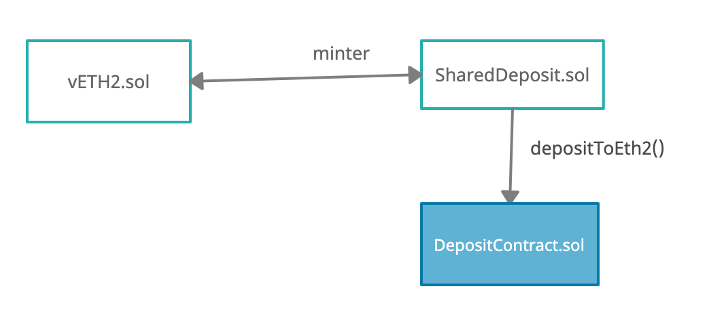
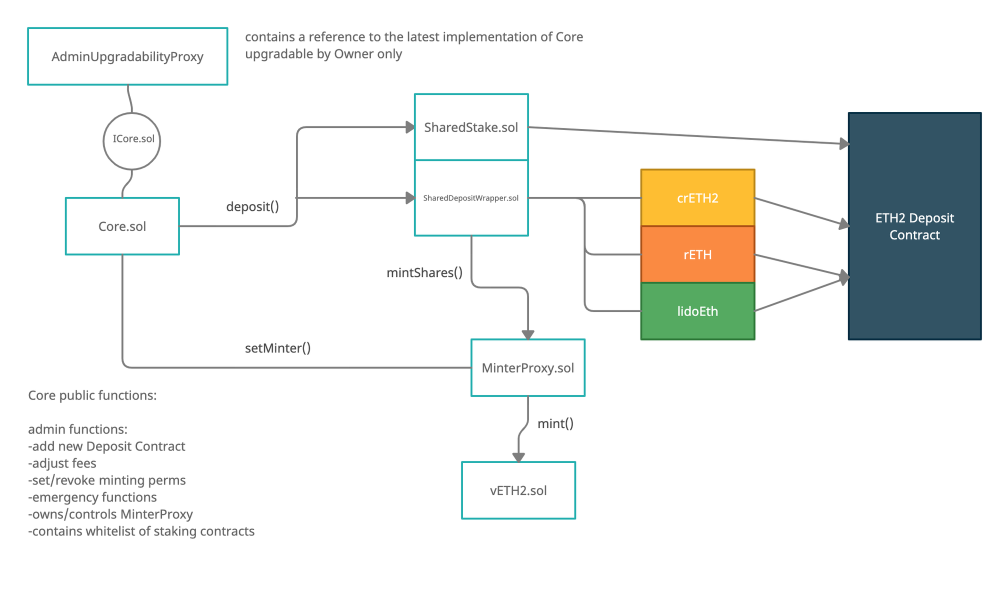

# 🤖 Explicación de los Contratos

Los contratos agrupan el ETH stakeado por los usuarios y automáticamente mandan lotes de 32 ETH a los validadores de ETH2. Esto es lo que ocurre:

1. Usuarios stakean ETH en los contratos inteligentes de SharedStake a través de la función de staking en la web de SharedStake.
2. Esto genera o acuña vEth2, un token que representa la posición depositada del usuario.
3. El ETH depositado se mantiene en un contrato inteligente transparente hasta que se llega al umbral de 10 o 100 validadores.
4. En este punto, un Desarrollador Principal de SharedStake crea las llaves privadas y el mnemónico a través de la línea de comando y luego realiza el depósito en el contrato de staking de ETH2 mediante la función`deposit_to_eth2`.
5. Esta función transfiere el ETH al contrato de staking de ETH2 haciendo el depósito y pasando las llaves públicas y la información requerida adicional. 

Este proceso permite a los holders stakear cualquier cantidad de Ethererum que quieran y aprovecharse de la reducción de costes gracias a que forman parte de un gran pool con el cual comparten estos costes, maximizando así sus beneficios.

### **Arquitectura planeada para la V2**


**Todos nuestros contratos son de código abierto y pueden encontrarse en el** [**Github de SharedStake**](https://github.com/SharedStake/Contracts)**.**


