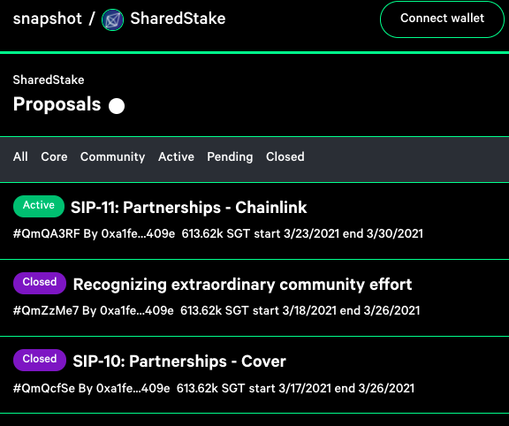
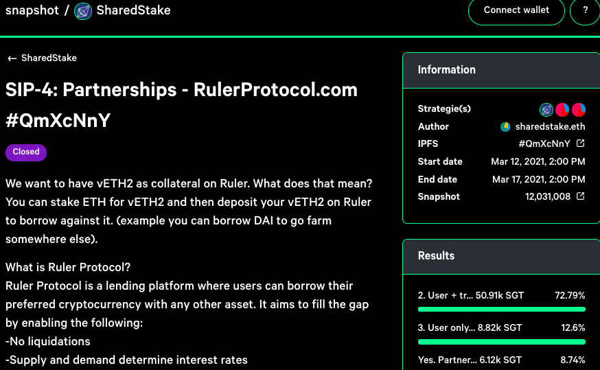

# 🗳️ Organización Anónima Descentralizada \(DAO\)

La prioridad número uno de SharedStake es mejorar la funcionalidad, la facilidad de uso del protocolo y su maximización de beneficios a través de SIPs y de votaciones mediante el uso del token SGT.

La segunda prioridad ya está en camino: convertirnos en una Organización Anónima Descentralizada ejemplar. Confiamos en el poder de la comunidad tanto como confiamos en lo que programamos.

### SIPs

Las Propuestas de Mejora de Sharedstake \(SharedStake Improvement Proposals o SIPs\) ayudan a describir los estándares de la plataforma, incluyendo las especificaciones del protocolo central, implementaciones en cadena y fuera de ella, además de mejoras de contrato y otras estrategias varias del protocolo.

SGT funciona como un token de gobernanza en estas propuestas y los miembros de la DAO proponen y votan en los SIPs. Los desarrolladores posteriormente aprueban e implementan las decisiones en los SIPs

Cualquiera puede hacer una propuesta proporcionando un borrador del SIP tanto en Github como poniéndose en contacto con algún administrador en nuestras redes sociales \(discord, twitter, telegram, etc.\).

#### **La votación se realizará en la página de snapshot de SGT**:

[https://snapshot.page/\#/sharedstake.eth](https://snapshot.page/#/sharedstake.eth)

