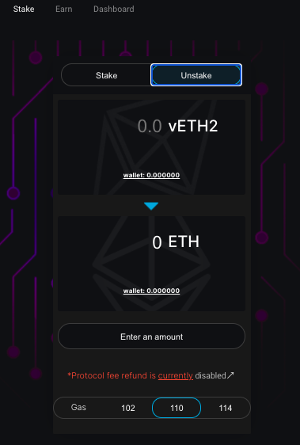

# 🧯 Recuperar tu Ethereum

Cambia a Unstake en [la página de stake ↗](https://www.sharedstake.org/stake)

* Conecta tu billetera e introduce cualquier importe que quieras o haz clic en MAX para recuperar todo tu vEth2, luego haz click en el botón de Unstake y aprueba la transacción en tu billetera.

