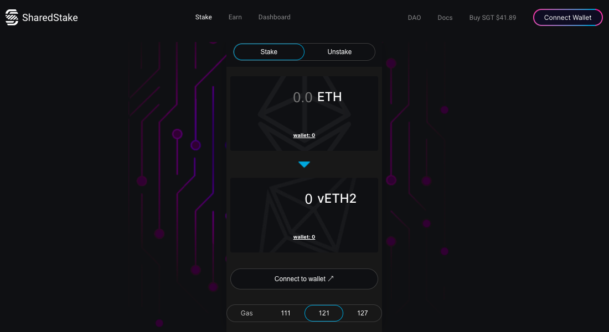
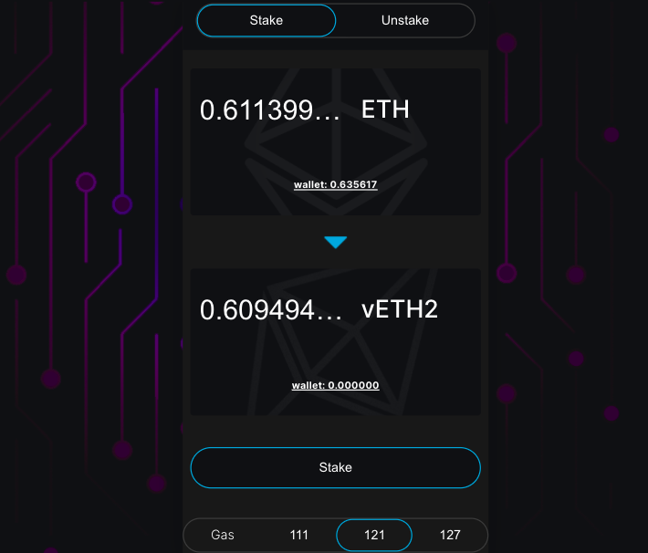
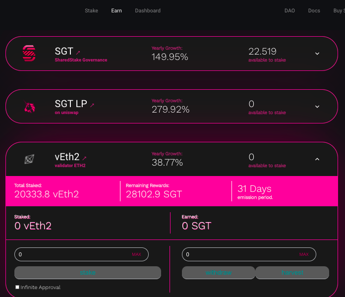

# 🔥 Stakear

* Entra en [SharedStake.org](https://www.sharedstake.org/) y haz click en “Stake”.

* Conecta tu billetera y selecciona la cantidad que desees depositar. Puedes hacer click en “max” para seleccionar directamente el máximo disponible, a continuación dale al botón de Stake:

* A continuación, aprueba la transacción en tu billetera. 

Una vez se apruebe tu transacción, recibirás una cantidad equivalente de vEth2 que puedes holdear o usar.

## **!Deposita también tu vEth2**! 

* Deposita tu vEth2 en la [página de Earn](https://www.sharedstake.org/earn) si quieres obtener recompensas inmediatamente.
* Haz click en vEth2 pool y escribe cuánto quieres stakear.

* ¡Haz click en el botón de Stake y empieza a generar SGT!

Puedes reclamar tus recompensas con el botón de Harvest sin retirar tu depósito de vEth2.


Dar acceso ilimitado da el máximo acceso posible al contrato de depósito y puede ser usado para hacer más eficientes los costes. Sin embargo esta es una opción avanzada que no es recomendada para la mayoría de los desarrolladores de Ethereum.


